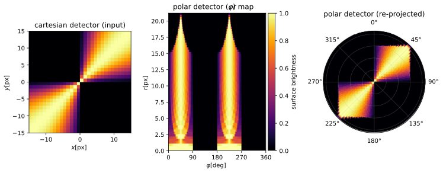

# Convert cartesian to polar detector

With this tool, you can precisely convert a cartesian detector to a polar detector.
**CartToPolarDetector** does not rely on any approximation methods like the nearest-neighbor method or interpolation.
This tool simply overlays a cartesian detector with a polar detector grid and computes the polar pixel values
depending on the cross-section areas with the cartesian pixels and their corresponding pixel values.
The method conserves the overall flux: the underlying value density of each cartesian pixel is assumed
to be homogeneous, and every polar pixel receives contributions weighted by the exact geometrical
intersection areas.



*The example detector of this repository converted to polar coordinates: the cartesian input (left),
the resulting polar detector as a (φ, r) map (center), and the same polar detector re-projected
onto the sky plane (right). The figure can be regenerated with [example/make_readme_figure.py](example/make_readme_figure.py).*

## Installation

The only dependency is `numpy`. To install the package, run the following line from the root of this repository:

```
pip install -e .
```

If you have problems with the installation you may also simply import *./src/CartToPolarDetector.py* and use it.

## Quick start

```python
import numpy as np
from CartToPolarDetector import convert, read_input

# Load a 2D cartesian detector array, e.g., the example data of this repository
data_cart = np.load("example/input/cartesian_detector.npz")["example_cart_detector"]

# Convert it to a polar detector with 96 angular and 96 radial cells
data_polar = convert("example/input/cartesian_detector.npz", data_cart, N_phi=96, N_r=96)
```

The returned array `data_polar[phi, r]` samples the angle phi linearly from 0 to 2·pi (`N_phi` cells,
`N_phi` must be a positive multiple of 4) and the radius linearly from 0 to `R_px_max` (`N_r` cells).
The angle phi = 0 points in positive y-direction and phi = pi/2 in positive x-direction.
Optionally, `convert` also stores the results on disk (see the docstring of `convert` for
all parameters, e.g., `center_shift`, `R_px_max_in`, `results_folder_path`, `save_name`).

## Examples

A few examples with illustrations and explanations are presented in a notebook: [example/example_convert.ipynb](example/example_convert.ipynb).
This short tutorial additionally requires `matplotlib`. It demonstrates:

- loading the example detector in [example/input/cartesian_detector.npz](example/input/cartesian_detector.npz) (a wavy pattern with positive and negative pixel values),
- converting the full detector as well as a shifted, zoomed-in region,
- generating radial and azimuthal profiles from the polar detector.

The folder [example/results/wave_example3](example/results/wave_example3) contains the pre-computed output of one of these conversions.
Each result folder stores the polar detector (`output.npz`, accessed via `np.load("output.npz")["polar"]`),
the polar grid cell borders (`phi_border_values.dat`, `r_border_values.dat`), and a summary of the
used input parameters (`input.dat`), which can be read back with `read_input`.

## Tests

The test suite in [tests/](tests/) checks the invariants of the conversion (flux conservation,
correct polar pixel areas, rotation symmetry) and reproduces the pre-computed example result.
It requires `pytest` and runs from the repository root:

```
pytest
```

## Citation

If **CartToPolarDetector** is integral to a scientific publication, please cite the accompanying paper
(the conversion method is described in its Appendix B):

> Krieger, A., & Wolf, S. 2022, A&A, 662, A99: *Feasibility of detecting and characterizing embedded low-mass giant planets in gaps in the VIS/NIR wavelength range*
> DOI: [10.1051/0004-6361/202142652](https://doi.org/10.1051/0004-6361/202142652), arXiv: [2203.01891](https://arxiv.org/abs/2203.01891)

Citation metadata for the software itself is provided in [CITATION.cff](CITATION.cff).
ORCID of the author: https://orcid.org/0000-0002-3639-2435


